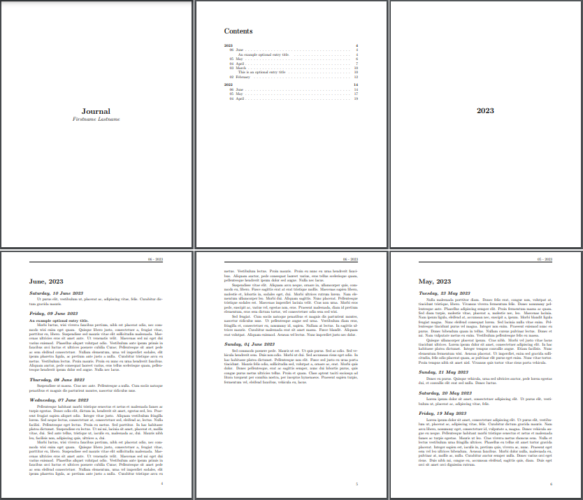

# journal
This is a $\LaTeX$ template for a personal journal. It was inspired by the [Personal Journal Overleaf Latex template](https://www.overleaf.com/latex/templates/personal-journal-template/cnhkpjpfkrdn). See the [build output](build/main.pdf) for an example rendering of the journal format.

## Resources
The repository contains two categories of files:

### Template Files.
This includes the structured `.tex` files, sample content `.tex` files, and `.pdf` build output. These files are Operating System (OS)-agnostic and should be portable to any system running $\LaTeX$. No OS commands are included in the `.tex` files.

### Script Files
These are Bourne Again SHell ([Bash](https://www.gnu.org/software/bash/)) scripts I use for adding entries to the journal. The scripts are specific to my environment (Windows Operating System (OS) using Windows Subsystem for Linux (WSL)) and consequently will likely not apply to your particular setup. The end goal of the scripts is to generate a new journal entry saved in `./content/{%Y}/{%Y-%m-%d}.tex`, followed by updating the `index.tex` file to reference the existing files.  If you are to incorporate this journal template into your own use, you will likely need your own process to generate `{%Y-%m-%d}.tex` entries as files, and a process to update the `index.tex` file. This can be as simple as opening a text editor and saving new journal entries as needed within the `content` folder, then manually updating the `index.tex` file. You can also script this process to make it easier.

The `main.tex` reads the `index.tex` containing a list of files (corresponding to journal entries), and generates the `.pdf` journal. For my purposes, the scripts use GPG to provide a decrypt -> journalize  -> encrypt process.
